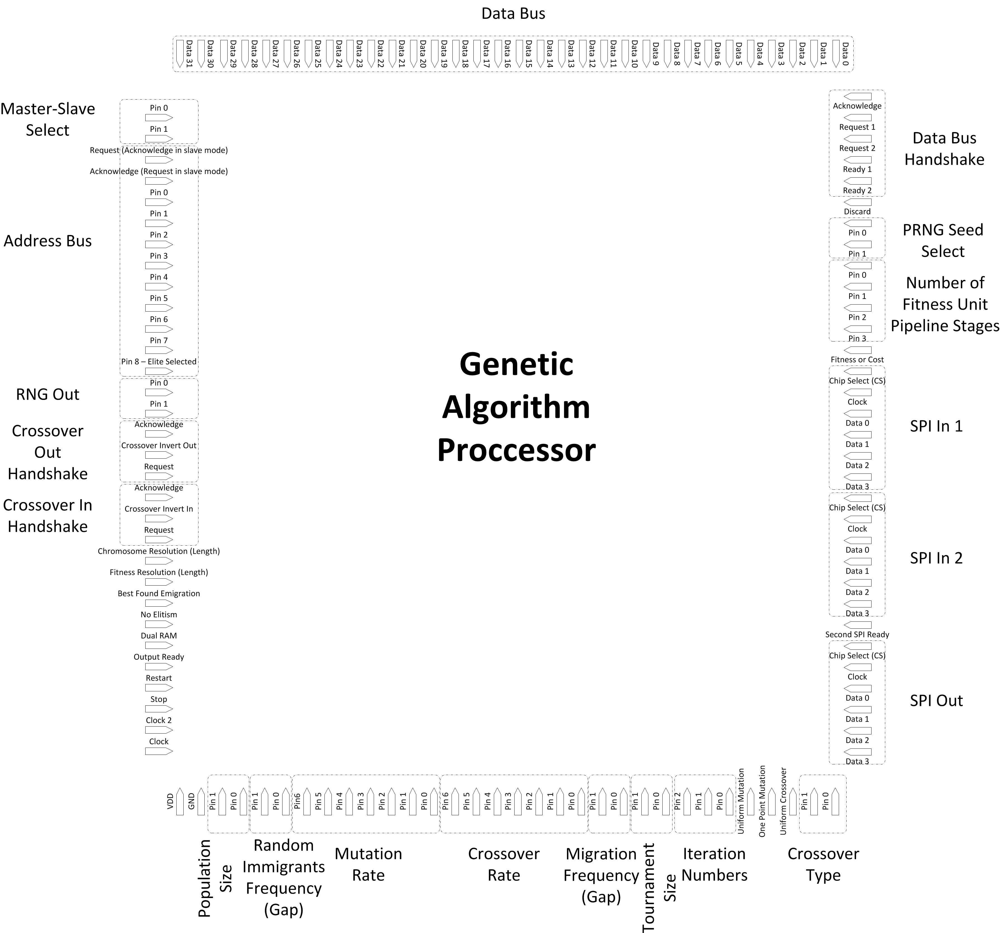
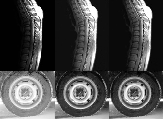

# Genetic Algorithm Processor (GAP)
This is a transistor-level digital CMOS implementation of genetic algorithm in 0.18 &#956;m process. Due to the heavy computational load of genetic algorithms, they usually take long times to find optimum solutions. Hardware implementation is a significant approach to overcome the problem by speeding up the genetic algorithm’s procedure. 

## Description
Detailed description of the design and results can be found in our papers: TCYB ([pdf](https://github.com/pouryahoseini/Genetic-Algorithm-Processor/blob/master/docs/2016-TCYB.pdf) or [IEEE Xplore](https://doi.org/10.1109/TCYB.2015.2451595)) and ICECS ([pdf](https://github.com/pouryahoseini/Genetic-Algorithm-Processor/blob/master/docs/2011-ICECS.pdf) or [IEEE Xplore](https://doi.org/10.1109/ICECS.2011.6122355)). The genetic algorithm processor (GAP) is general-purpose, i.e. is not bounded to a specific application. Utilizing speed boosting techniques, such as pipelining, parallel coarse-grained processing, parallel fitness computation, parallel selection of parents, dual-population scheme (our other [work](https://github.com/pouryahoseini/Dual-Population-Genetic-Algorithm)), and support for pipelined fitness computation, the GAP significantly reduces the processing time. Further, through its built-in support of discarding infeasible solutions it may be used in constrained problems. A large search space is achievable by bit string length extension of chromosomes by connecting the 32-bit GAPs. In addition, the GAP supports parallel processing, in which the genetic algorithm’s procedure can be run on several connected processors simultaneously. 
The following figure shows the input and output connections of the processor:
<p align="center">
  
</p>

The genetic algorithm processor can be tuned to the following parameters:
|Chromosome bit length|Selection method|Mutation method|General purpose|Fitness bit length|
|:--:|:--:|:--:|:--:|:--:|
|Unlimited (multi-GAP), Each GAP: 16, 32|Tournament, with 2, 4, 8, or 16 contestants|Uniform, 1-point|Yes|16, 32|
|**Simultaneous selection and replacement**|**Population size**|**Crossover method**|**Coarse-grained parallel processing**|**Parallel parent selection**|
|Yes, by using dual-population scheme|32, 64, 128, 256|Uniform, 1-point, 2-point|Yes, adjustable|Yes|
|**Iteration number**|**Operators for control or online applications**|**Pipelined fitness computation**|**Number of possible fitness units**|**Number of crossover rates**|
|16, 32, 64, 128, 256, 512, 1024, 2048|Random immigrants, Bad solutions discard|Yes, up to 15 pipeline stages|2|129|
|**RNG seeds**|**Parameters adjustable after fabrication**|**Elitism**|**Pipelined genetic algorithm**|**Number of mutation rates**|
|16 predefined true random seeds|Yes|Yes|Yes|129|

In the tests, the GAP has a **speedup of 5391x** over a software counterpart written in C language on 2x2.5 GHz CPU. It is also at least **55** times faster than any other genetic algorithm processor in the literature. The sppedups are obtained while the results are closely identical to serial genetic algorithm on software. Below is an example of the application of genetic algorithm in image enhancement. In the figure, the first column is the original image, the second column is the result after contrast enhancement by the genetic algorithm, and the third column is the result obtained from the hardware version of the genetic algorithm:
<p align="center">
  
  <br>
  <em>Left: original images, Middle: after contrast enhancement by  genetic algorithm, Right: after enhancement by the GAP</em>
</p>

## The code
The GAP is a transistor-level digital CMOS implementation of genetic algorithm in SPICE language in the CSMC 0.18 &#956;m process. It was simulated by Synopsis HSIM and CustomSIM. The netlists containing the implementation are located under the *gap* directory. The file *GAP.inc" is the top-level interface; other files are modules invoked by it. There are two implementations of a 16 kbit RAM in the work too, one a transistor-level SPICE implementation (*RAM.inc*) and another a Verlog-A implementation (*RAM.va*). For more accurate results *RAM.inc* should be used, while for a faster simulation time *RAM.va* is more suitable.
The *tests* folder includes the files necessary for testing the processor. Inside it, the *hardware-tests* folder containts the fitness functions, used as the test cases in our TCYB paper (written in Verilog-A), and periphery circuitry to connect them to the GAP(s) (written in SPICE). The *software-tests* folder, on the other hand, holds the software code equivalent of the hardware tests. Although they are written in MATLAB, they can be converted to C code via MATLAB Coder for faster running times.

# Cite
You may refer to this work by citing our published papers at [IEEE Transacions on Cybernetics](https://doi.org/10.1109/TCYB.2015.2451595) or [International Conference on Electronics, Circuits, and Systems](https://doi.org/10.1109/ICECS.2011.6122355).
```
@article{alinodehi2015high,
  title={High-speed general purpose genetic algorithm processor},
  author={Alinodehi, Seyed Pourya Hoseini and Moshfe, Sajjad and Zaeimian, Masoumeh Saber and Khoei, Abdollah and Hadidi, Khairollah},
  journal={IEEE transactions on cybernetics},
  volume={46},
  number={7},
  pages={1551--1565},
  year={2015},
  publisher={IEEE}
}
```
```
@inproceedings{hoseini2011fast,
  title={Fast and flexible genetic algorithm processor},
  author={Hoseini, Pourya and Khoei, Abdollah and Hadidi, Khayrollah and Moshfe, Sajjad},
  booktitle={2011 18th IEEE International Conference on Electronics, Circuits, and Systems},
  pages={635--638},
  year={2011},
  organization={IEEE}
}
```

# Contact
I can be reached at hoseini@nevada.unr.edu.
